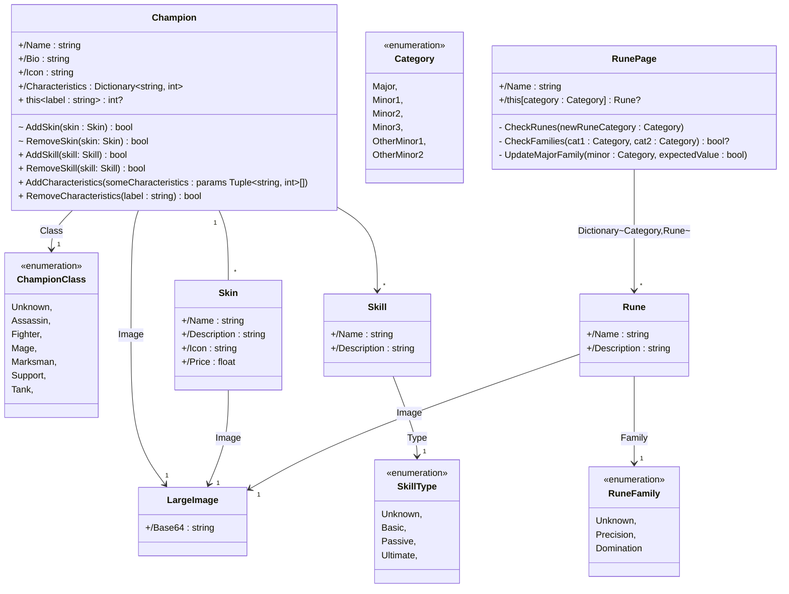
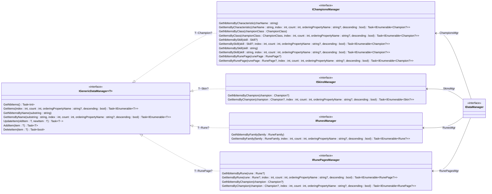
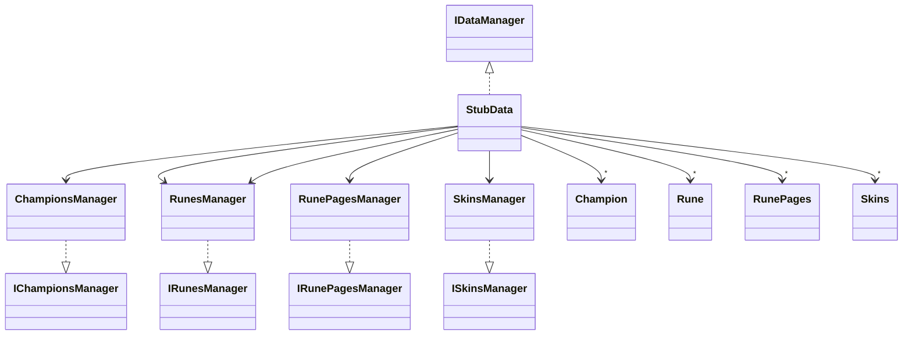

 League of Legend

Ce projet a été réalisé en 2ème année de BUT en Informatique lors des cours de consommation et développements de services et entity framework avec le langage de programmation C#. 

## Lancer notre projet

Le projet est disponible sur la branch 'master'. Il suffit de la cloner et d'instaler les nugets necessaires au projet tel que les nugets concernant EntityFramework. 

## Consommation et développements de services

Cette partie consistait à réaliser une API RESTFull. Pour cela, nous avions à notre disposition un diagramme de classe, et c'était à nous de savoir qu'elle requête CRUD implémenter. Une fois que nous avions développée l'API, nous devions la consommer via une application MAUI fournit par nos professeurs, mais par manque de temps nous ne l'avons pas fait. 

L'implémentation des requêtes CRUD nous a amené à réfléchir au code de retour que nous indiquons à nos clients. Egalement, nous devions respecter les règles de routage et utiliser les logs car ils permettent, en cas d'erreur, d'indiquer précisément aux clients ce qu'il s'est passé.

## Entity framework

Entity framework est un outil de mappage objet-relationnel (ORM), permettant de créer des bases de données à partir de classes appelé entité qui seront les tables de notre BDD et les attributs des classes qui seront les colonnes. C'est donc un gain de temps pour les développeurs car nous avons simplement à ajouter des migrations grâce à la commande 'dotnet ef add migrations' puis à les appliquer à notre base de données via 'dotnet ef database update'. 

Dans cette partie, nous avons aussi implémenter les méthodes de l'interface IDataManager pour les entités Champions et Skins afin de faire la liaison avec l'API. En effet, au départ notre API aviat en injection de dépendance IDataManager faisant référence au stub qui nous était fournit. Ensuite, le mieux était d'injecter notre base de données pour faire persisté nos données, c'est à-dire que si les clients supprimes le champion qui possède l'id 1, alors cette modification sera conservée.

## Le modèle

Le modèle de notre projet conserne le jeu ligue of légend et il nous as été fournit par nos professeurs. Il contient différentes classes servantes à modéliser des objets. 

### La classe Champion

C'est la classe principal du modèle. Elle possède divers attributs comme un nom, une biographie ou encore une image. Elle est reliée à d'autre classe qui sont ses attributs. Par exemple, elle a un lien one to many avec la classe Skin car un champion peut posséder 0 ou plusieurs skins et un skin peut être possédé par 1 seule champion. Nous avons également considéré qu'un champion et une caractéristique ou une relation many to many.  

### La classe Rune

C'est aussi une classe que nous avons considéré comme étant à part dans le modèle puisqu'elle n'est pas reliée avec la classe Champion, mais avec runePage car une rune est contenu dans une page et une page possède plusieur

# prepaLoL

## Diagramme de classes du modèle

## Diagramme de classes des interfaces de gestion de l'accès aux données

## Diagramme de classes simplifié du Stub
