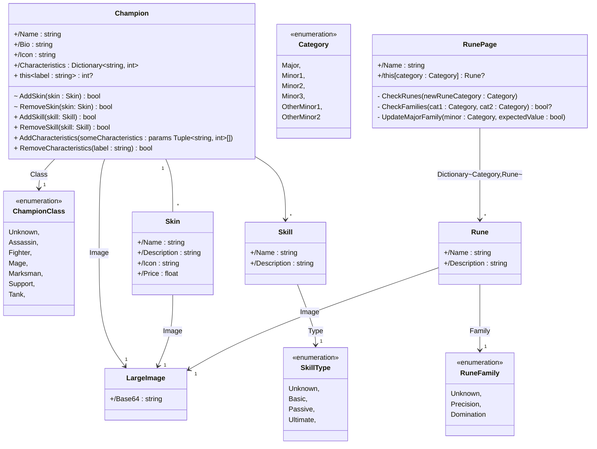
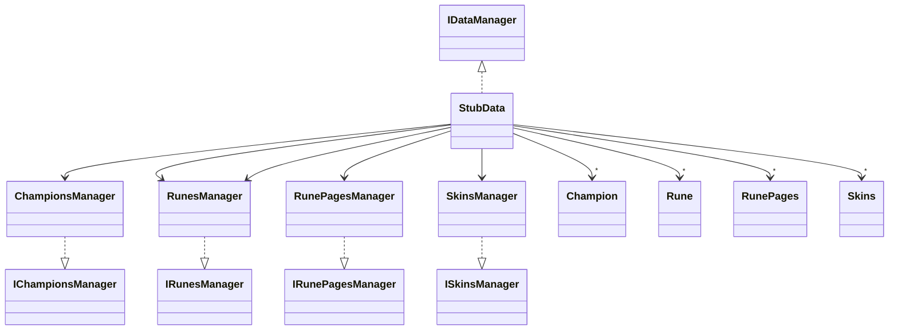

# League Of Legends

Ce projet a été réalisé en deuxième année de BUT Informatique lors des cours de Consommation et Développements de services et Entity Framework avec le langage de programmation C#.

Il consistait à réaliser d'une part une API, et d'autre part une Base de Données, toutes deux sur le thème du jeu League Of Legends. Il nous fallait donc diverses classes telles que Champion, Rune, Skin, etc, avec divers attributs, comme des id, des nom, des descriptions...

## Lancer notre projet

Le projet est disponible sur la branche 'master'. Il suffit de la cloner et d'installer les nuggets nécessaires au projet tel que les nuggets concernant EntityFramework.

## Consommation et développements de services

Cette partie consistait à réaliser une API RESTFull. Pour cela, nous avions à notre disposition un ensemble de classes déjà implémentées qui formaient notre modèle, ainsi que son diagramme de classe.

À partir de ces éléments, nous avons donc déterminé quelles requêtes CRUD nous devions coder. Une fois que nous avions développé l'API, nous devions la consommer via une application MAUI fournit par nos professeurs, et une via une application Console, mais nous n'avons pas réussi à résoudre les problèmes de changement de versions, et avons manqué de temps, ce qui explique l'absence de liens entre l'application mobile et l'API. 

L'implémentation des requêtes CRUD nous a amenées à réfléchir aux différents codes de retours que devrait renvoyer notre API. Également, nous devions respecter les règles de routage pour avoir une API RESTfull et utiliser les logs, car ils permettent, en cas d'erreur, d'indiquer précisément aux clients ce qu'il s'est passé. Nous avons également tenté d'utiliser les fichiers de configuration, mais les problèmes de Déploiement Continu nous en ont empêché.

## Entity framework

Entity framework est un outil de mappage objet-relationnel (ORM), permettant de créer des bases de données à partir de classes appelées entités qui seront les tables de notre Base de Données et les attributs de ces classes qui seront les colonnes de nos tables. C'est donc un gain de temps pour les développeurs, car nous avons simplement à ajouter des migrations grâce à la commande `dotnet ef add migrations` puis à les appliquer à notre base de données en utilisant `dotnet ef database update`.

Dans cette partie, nous avons aussi implémenté les méthodes de l'interface IDataManager pour les entités Champions et Skins afin de faire la liaison avec l'API. En effet, notre API avait au départ une injection de dépendance qui liait IDataManager à une de ses filles, en l'occurrence le Stub, qui nous était fourni. Mais ensuite, il a fallu remplacer ce dernier par notre Base de Données pour persister nos données, et faire en sorte que les modifications et autres requêtes sur la base soient conservées.

### La classe Champion

C'est la classe principale du modèle. Elle possède divers attributs de types primitifs comme un nom (int), une biographie (string) ou encore une icône (string), mais aussi de types plus complexes. Par exemple, un Champion possède plusieurs Skin, qui est une autre classe du modèle. Cela se traduit par une relation "OneToMany", car un Champion est lié à plusieurs Skin, quand un Skin n'appartient qu'à un seul Champion. Ainsi, dans notre Base de Données, la table Skin possède un attribut appelé ChampionEntity, qui correspond au champion auquel il est lié.

Le Champion possède également une relation "ManyToMany", car nous savions qu'un Champion avait plusieurs Characteristic, et avons considéré qu'une Characteristic pouvait être liée à plusieurs Champion. Dans notre Base de Données, nous aurons donc une table Champion, une table Characteristic, et une table de liaisons entre les deux.

### La classe RunePage

C'est une classe à part dans le modèle puisqu'elle n'est pas reliée avec la classe Champion, et possède seulement une relation "ManyToMany", en ayant dans ses attributs plusieurs Rune, et les Rune appartenant à plusieurs RunePage.

# prepaLoL

## Diagramme de classes du modèle

## Diagramme de classes des interfaces de gestion de l'accès aux données

## Diagramme de classes simplifié du Stub
